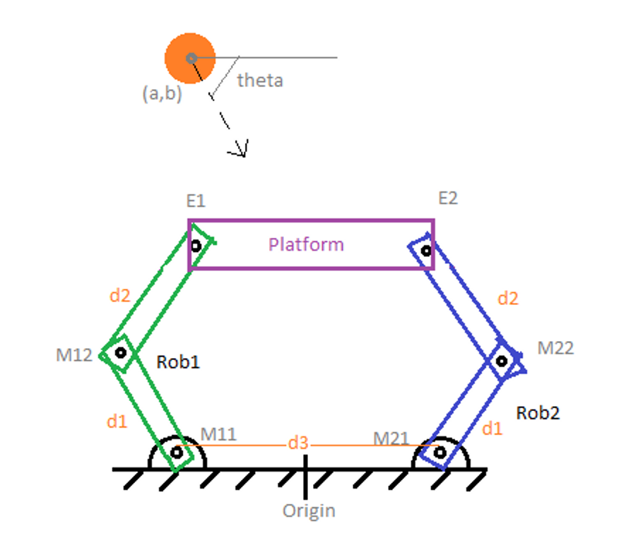

# 6bar_linkage_Kinematics
This is a c++ code for attemting to bounce a ball coming on a 6 bar linkage closd chain mechanism at an angle of theta using Forward and Inverse Kinematics with DH parameters.

